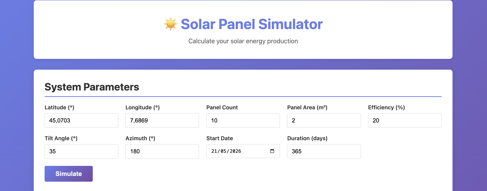
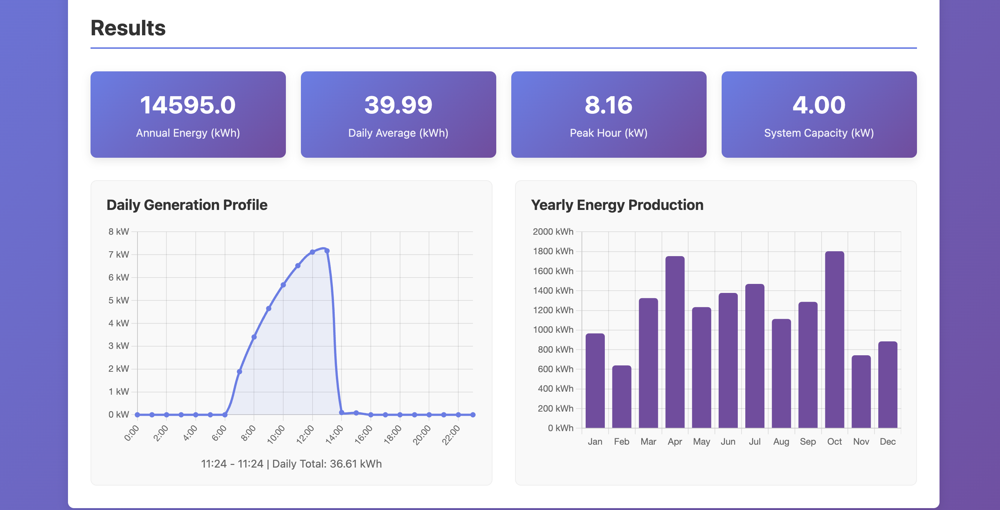

# Disclaimer
This app is generated by AI to experiment with the BMAD method. Development is not complete. Results might be inaccurate, best coding practices are yet to be implemented.

# Solar Panel Simulator

An interactive web application that models solar panel energy production based on system parameters. Quickly experiment with different configurations to understand how design choices affect annual energy generation.

### Sample input

### Sample results


## Features

- 📊 **Interactive simulation** — Adjust panel count, efficiency, tilt angle, and location in real-time
- 📈 **Live visualizations** — Daily hourly generation curves and monthly energy production charts
- 🌍 **Global calculations** — Accurate solar geometry for any latitude/longitude
- ⚡ **Fast results** — Get simulation results in seconds with instant graph updates
- 🎯 **Educational** — Understand how solar systems work through interactive modeling

## Quick Start

### Prerequisites
- Docker and Docker Compose
- Or: Python 3.11+, Node.js (for standalone frontend)

### Run with Docker Compose

```bash
docker-compose up
```

Then open in your browser:
- **Frontend:** http://localhost:3000
- **Backend API docs:** http://localhost:8000/docs

## Deployment

For production deployment with HTTPS via nginx and Let's Encrypt:

```bash
cp nginx.conf.example nginx.conf
# edit nginx.conf — replace solar.yourdomain.com with your domain
docker compose -f docker-compose.prod.yml --env-file .env.prod up -d
```

- **[DEPLOYMENT.md](DEPLOYMENT.md)** — full step-by-step guide (DNS, certificates, nginx, docker-compose)
- **[SECURITY.md](SECURITY.md)** — pre-deployment security checklist

### Manual Setup

**Backend:**
```bash
cd backend
uv pip install --system -e .
uvicorn app.main:app --reload
```

**Frontend:**
```bash
cd frontend
python -m http.server 3000
```

## Project Structure (TODO: update)

```
bmad-solar-panels/
├── backend/
│   ├── app/
│   │   ├── main.py           # FastAPI application
│   │   ├── calculator.py     # Energy calculations
│   │   ├── solar_position.py # Sunrise/sunset (NOAA algorithm)
│   │   ├── irradiance.py     # Solar irradiance estimation
│   │   ├── models.py         # Pydantic schemas
│   │   ├── constants.py      # Physical constants
│   │   └── validation.py     # Input validation
│   ├── tests/                # Unit tests
│   ├── pyproject.toml        # Dependencies
│   └── Dockerfile
├── frontend/
│   ├── index.html            # HTML form and containers
│   ├── style.css             # Responsive styling
│   ├── app.js                # Vanilla JS logic
│   └── Dockerfile
├── docker-compose.yml        # Orchestration
└── README.md
```

## Technology Stack

**Backend:**
- FastAPI (Python web framework)
- Pydantic (data validation)
- UV (fast package manager)
- Docker

**Frontend:**
- Vanilla JavaScript (no frameworks)
- Chart.js (interactive graphs)
- HTML5 + CSS3 (responsive design)
- Fetch API (backend communication)

## Inputs

- **Location:** Latitude, Longitude
- **System specs:** Panel count, area, efficiency, tilt angle, azimuth
- **Duration:** Start date and simulation length (days)

## Outputs

- Annual energy production (kWh)
- Daily average generation (kWh/day)
- Peak hourly power (kW)
- System capacity (kW)
- Hourly generation profile (daily chart)
- Monthly energy breakdown (yearly chart)

## Calculation Details
TODO: UPDATE FORMULAS
### Energy Calculation
```
Power (W) = Panel Area × Efficiency × Irradiance × System Losses × Temperature Derating
Energy (kWh) = Power × Hours / 1000
```

### Key Assumptions
- System losses: 5.8% (inverter 97%, wiring 1%, soiling 2%)
- Temperature derating: 0.4% per °C above 25°C
- Weather: Heuristic clear-sky model (real API integration future)
- Panel orientation: Fixed tilt (no tracking)

### Limitations
- Simplified heuristic weather model (for MVP)
- No cloud cover variation
- No shading analysis
- ±10% accuracy target vs. PVGIS

## Known Issues

- Energy production calculation is inaccurate

## Future Enhancements

- [ ] Battery simulation (storage & discharge)
- [ ] Real weather API integration (PVGIS/NREL)
- [ ] Scenario comparison (side-by-side)
- [ ] Export results (PDF, CSV)
- [ ] User accounts & saved simulations
- [ ] Mobile app

## Development

### Backend Unit Tests
```bash
cd backend
pytest tests/ -v
pytest tests/ --cov=app --cov-fail-under=80  # with coverage
```

### Integration Tests
```bash
cd backend
pytest tests/test_main_integration.py -v
```

### E2E Testing (Playwright)
```bash
npm run test:e2e              # Run tests in headless mode
npm run test:e2e:headed       # Run with browser visible (debugging)
npm run test:e2e:ui           # Interactive test explorer
npm run test:e2e:debug        # Step through with inspector
```

Test files are in `frontend/e2e/` and use Playwright for browser automation. See [Playwright docs](https://playwright.dev) for detailed syntax.

### API Documentation
When backend is running, visit: http://localhost:8000/docs

## License

MIT

## Author

Dario Scanferlato

---
