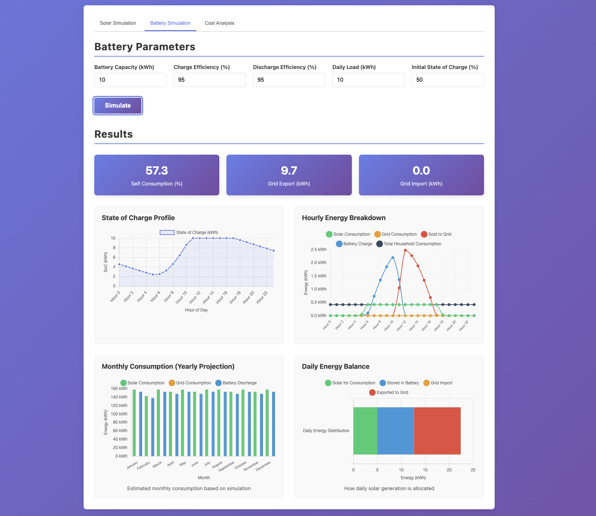
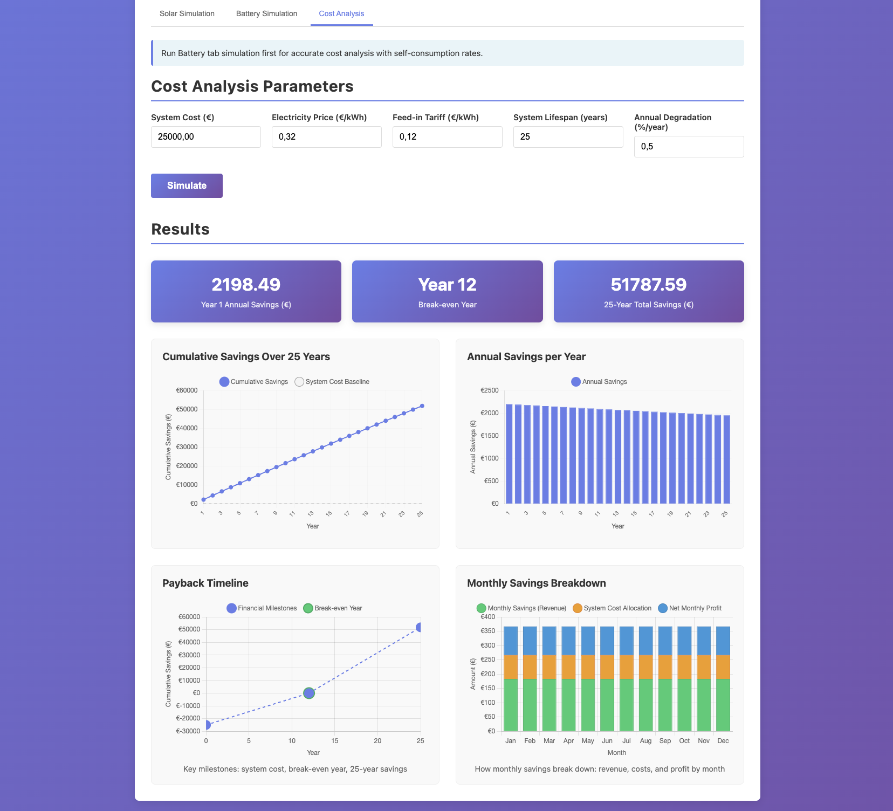

# Solar Panel Simulator

An interactive web application that models solar panel energy production, battery storage, and financial viability based on system parameters. Experiment with different configurations across three simulation tabs to understand energy generation, self-consumption, and investment payback.

### Energy production

### Battery and consumption statistics

### Financial simulation


## Features

- 📊 **Solar simulation** — Adjust panel count, efficiency, tilt angle, and location; get instant annual and monthly generation charts
- 🔋 **Battery storage simulation** — Model household energy balance with a battery system; calculate self-consumption rate, grid import/export, and hourly state-of-charge
- 💰 **Cost analysis** — 25-year ROI projection with payback timeline, monthly savings breakdown, and feed-in tariff modeling
- 📈 **Live visualizations** — Daily hourly generation curves, monthly energy charts, SoC curves, payback timelines, and profit breakdowns
- 🌍 **Global calculations** — Accurate solar geometry for any latitude/longitude using NOAA algorithm
- ⚡ **Fast results** — Simulation results in under 500ms with in-place chart updates

## Quick Start

### Prerequisites
- Docker and Docker Compose
- Or: Python 3.11+, Node.js (for standalone frontend)

### Run with Docker Compose

```bash
docker-compose up
```

Then open in your browser:
- **Frontend:** http://localhost:3000
- **Backend API docs:** http://localhost:8000/docs

## Deployment

For production deployment with HTTPS via nginx and Let's Encrypt:

```bash
cp nginx.conf.example nginx.conf
# edit nginx.conf — replace solar.yourdomain.com with your domain
docker compose -f docker-compose.prod.yml --env-file .env.prod up -d
```

- **[DEPLOYMENT.md](DEPLOYMENT.md)** — full step-by-step guide (DNS, certificates, nginx, docker-compose)
- **[SECURITY.md](SECURITY.md)** — pre-deployment security checklist
- **[ACCESSIBILITY.md](ACCESSIBILITY.md)** — WCAG AA compliance notes

### Manual Setup

**Backend:**
```bash
cd backend
uv pip install --system -e .
uvicorn app.main:app --reload
```

**Frontend:**
```bash
cd frontend
python -m http.server 3000
```

## Project Structure

```
bmad-solar-panels/
├── backend/
│   ├── app/
│   │   ├── main.py               # FastAPI app, API endpoints
│   │   ├── calculator.py         # Solar energy calculations
│   │   ├── solar_position.py     # Sunrise/sunset (NOAA algorithm)
│   │   ├── irradiance.py         # 8-step heuristic irradiance model
│   │   ├── battery.py            # Battery storage physics model
│   │   ├── cost.py               # 25-year ROI and cost analysis
│   │   ├── models.py             # Pydantic request/response schemas
│   │   ├── constants.py          # Physical constants
│   │   └── validation.py         # Input validation helpers
│   ├── tests/                    # pytest unit + integration tests
│   ├── pyproject.toml            # uv-managed dependencies
│   └── Dockerfile
├── frontend/
│   ├── index.html                # HTML with 3-tab structure
│   ├── style.css                 # Responsive styling
│   ├── app.js                    # Sole orchestrator (no circular imports)
│   ├── api.js                    # All fetch() calls (only module allowed)
│   ├── charts.js                 # Solar simulation charts
│   ├── forms.js                  # Solar simulation form + result cards
│   ├── tabs.js                   # Tab switching logic
│   ├── battery-forms.js          # Battery form + result cards
│   ├── battery-charts.js         # Battery chart orchestrator
│   ├── battery-balance-chart.js  # Hourly energy balance chart
│   ├── battery-breakdown-chart.js# Charge/discharge breakdown
│   ├── battery-yearly-chart.js   # Yearly consumption analysis
│   ├── cost-forms.js             # Cost analysis form + result cards
│   ├── cost-charts.js            # Cost chart orchestrator
│   ├── cost-timeline-chart.js    # Payback timeline chart
│   ├── cost-monthly-chart.js     # Monthly revenue/profit chart
│   ├── __tests__/                # Jest unit tests (jsdom)
│   ├── e2e/                      # Playwright E2E tests
│   └── Dockerfile
├── docker-compose.yml            # Dev orchestration
├── docker-compose.prod.yml       # Production orchestration
├── nginx.conf.example            # nginx reverse proxy template
├── playwright.config.ts          # Playwright E2E configuration
├── README.md
├── DEPLOYMENT.md
├── SECURITY.md
└── ACCESSIBILITY.md
```

## Technology Stack

**Backend:**
- FastAPI (Python web framework)
- Pydantic (data validation and schemas)
- uv (fast package manager — use `uv`, not pip)
- httpx==0.24.1 (pinned for test compatibility)
- Docker

**Frontend:**
- Vanilla JavaScript — ES6 native modules, no bundler, no build step
- Chart.js (interactive graphs, in-place updates)
- HTML5 + CSS3 (responsive design)
- Fetch API (all calls via `api.js` only)

**Testing:**
- pytest + pytest-cov (backend unit + integration, >80% coverage gate)
- Jest + jsdom (frontend unit tests)
- Playwright (end-to-end browser automation)

## Inputs

### Solar Simulation
- **Location:** Latitude, Longitude
- **System specs:** Panel count, area per panel (m²), efficiency (%), tilt angle (°), azimuth (°)
- **Duration:** Start date and simulation length (days)

### Battery Simulation
- **Battery capacity** (kWh)
- **Max charge / discharge power** (kW)
- **Daily household load** (kWh)
- **Initial state of charge** (%)

### Cost Analysis
- **System installation cost** (€)
- **Electricity price** (€/kWh)
- **Feed-in tariff** (€/kWh)
- **Annual electricity price increase** (%)

## Outputs

### Solar Simulation
- Annual energy production (kWh)
- Daily average generation (kWh/day)
- Peak hourly power (kW)
- System capacity (kW)
- Hourly generation profile (daily chart)
- Monthly energy breakdown (yearly chart)

### Battery Simulation
- Self-consumption rate (%)
- Grid import and grid export (kWh/year)
- Hourly state-of-charge curve
- Daily energy balance breakdown (solar, battery, grid)
- Annual consumption vs generation chart

### Cost Analysis
- Payback period (years)
- 25-year cumulative ROI (€)
- Annual electricity savings breakdown
- Cumulative payback timeline chart
- Monthly revenue and profit breakdown

## Calculation Details

### Solar Irradiance (8-step heuristic model)
1. **Spencer equation** — day-of-year solar declination and equation of time
2. **Kasten-Young atmosphere** — air mass and atmospheric transmittance
3. **Laue/Meinel diffuse** — diffuse horizontal irradiance estimate
4. **Seasonal cloud factor** — latitude-adjusted monthly cloud attenuation
5. **Erbs decomposition** — beam/diffuse split from global horizontal irradiance
6. **Isotropic transposition** — tilt/azimuth conversion to panel plane

No external weather API — validated at ±6% vs PVGIS for Turin 4 kWp.

### Energy Calculation
```
Power (W) = Panel Area × Efficiency × Irradiance × System Losses × Temperature Derating
Energy (kWh) = Power × Hours / 1000
```

System losses: 5.8% (inverter 97%, wiring 1%, soiling 2%).
Temperature derating: 0.4% per °C above 25°C.
Panel orientation: fixed tilt (no tracking).

### Battery Physics Model
Hourly state-of-charge (SoC) state machine: solar generation covers household load first (direct self-consumption); excess charges the battery up to capacity; remaining load after battery is depleted is imported from the grid; excess solar after full battery is exported. SoC is clamped between 0 and capacity each hour.

### Cost Model
25-year cash flow projection: annual electricity savings + feed-in tariff revenue − amortized system cost. Panel degradation of 0.5%/year reduces generation output each year. Payback year is the first year where cumulative net savings exceed system cost.

## Development

### Backend Unit Tests
```bash
cd backend
pytest tests/ -v
pytest tests/ --cov=app --cov-fail-under=80  # with coverage
```

### Integration Tests
```bash
cd backend
pytest tests/test_main_integration.py -v
```

### Frontend Unit Tests
```bash
cd frontend
npm test                # run Jest suite
npm run test:coverage   # with coverage report
```

### E2E Testing (Playwright)
```bash
npm run test:e2e              # Run tests in headless mode
npm run test:e2e:headed       # Run with browser visible (debugging)
npm run test:e2e:ui           # Interactive test explorer
npm run test:e2e:debug        # Step through with inspector
```

Test files are in `frontend/e2e/` and use Playwright for browser automation. See [Playwright docs](https://playwright.dev) for detailed syntax.

### API Documentation
When backend is running, visit: http://localhost:8000/docs

## Known Limitations

- Heuristic clear-sky model (no real cloud cover data) — validated at ±6% vs PVGIS for Turin 4 kWp; accuracy varies by location and climate
- No shading analysis
- No panel tracking (fixed tilt only)
- Battery model assumes constant daily load profile across all seasons

## Future Enhancements

- [ ] Real weather API integration (PVGIS/NREL)
- [ ] Scenario comparison (side-by-side configs)
- [ ] Export results (PDF, CSV)
- [ ] User accounts & saved simulations
- [ ] Mobile app

## License

MIT

## Author

Dario Scanferlato

---
